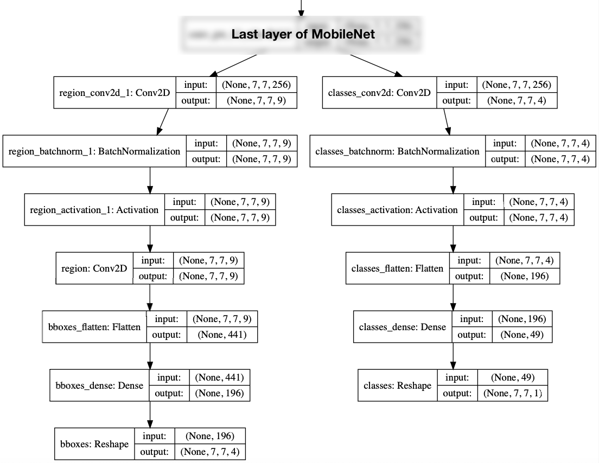

# Keras MobileDetectNet


MobileDetectNet is an object detector which uses [MobileNet][mobilenet] feature extractor to predict bounding boxes. It was designed to be computationally efficient for deployment on embedded systems and easy to train with limited data. It was inspired by the simple yet effective design of [DetectNet][detectnet] and enhanced with the anchor system from [Faster R-CNN][faster-r-cnn]. 

### Network Arcitecture


### Training

#### Preprocessing
Images are scaled between -1 and 1 to take advantage of transfer learning from pretrained MobileNet.

#### Anchors
MobileNet outputs a 7x7x256 from its last layer with a 224x224x3 input. In each of the 7x7 squares we place 9 anchors:

- Scale 1, 2, and 3
- Aspect Ratio 1, 4/3, and 3/4

We set the anchor to 1 if a rectangle has > 0.3 IoU with the anchor. The bounding box generated is given to the box with the highest IoU over 0.3.

Due to the smaller network receptive size and low spacial dimension output of MobileNet, anchors partially outside the image can be used.

#### Augmentation
Training is done with [imgaug][imgaug] utilizing Keras [Sequences][sequence] for multicore preprocessing and online data augmentation:

```python
return iaa.Sequential([
    iaa.Fliplr(0.5),
    iaa.CropAndPad(px=(0, 112), sample_independently=False),
    iaa.Affine(translate_percent={"x": (-0.4, 0.4), "y": (-0.4, 0.4)}),
    iaa.SomeOf((0, 3), [
        iaa.AddToHueAndSaturation((-10, 10)),
        iaa.Affine(scale={"x": (0.9, 1.1), "y": (0.9, 1.1)}),
        iaa.GaussianBlur(sigma=(0, 1.0)),
        iaa.AdditiveGaussianNoise(scale=0.05 * 255)
    ])
])
```

Data augmentation is also used for validation for the purpose of making sure smaller objects are detected. 
 
```python
return iaa.Sequential([
    iaa.CropAndPad(px=(0, 112), sample_independently=False),
    iaa.Affine(translate_percent={"x": (-0.4, 0.4), "y": (-0.4, 0.4)}),
])


```
 
If a dataset contains many smaller bounding boxes or detecting smaller objects is not a concern, this should be adjusted for both train and validation augmentation.

#### Loss
Standard loss functions are used for everything other than the bounding box regression, which uses `10*class_(ij)*|y_pred_(ij) - y_true_(ij)|` in order to not penalize the network for bounding box predictions without an object present and to normalize the loss against class loss. Class loss is binary crossentropy and region loss is mean absolute error.

#### Optimizer
[SGD with Warm Restarts][sgdr] seems to converge effectively for the application, but the standard Adam with LR=0.0001 will also work fine.

### Label Format
MobileDetectNet uses the KITTI label format and directory structure. See [here for more details][kitti]

[mobilenet]: https://arxiv.org/abs/1704.04861
[imgaug]: https://github.com/aleju/imgaug
[sequence]: https://keras.io/utils/
[sgdr]: https://arxiv.org/abs/1608.03983
[kitti]: https://github.com/NVIDIA/DIGITS/tree/master/digits/extensions/data/objectDetection
[detectnet]: https://devblogs.nvidia.com/detectnet-deep-neural-network-object-detection-digits/
[faster-r-cnn]: https://arxiv.org/abs/1506.01497